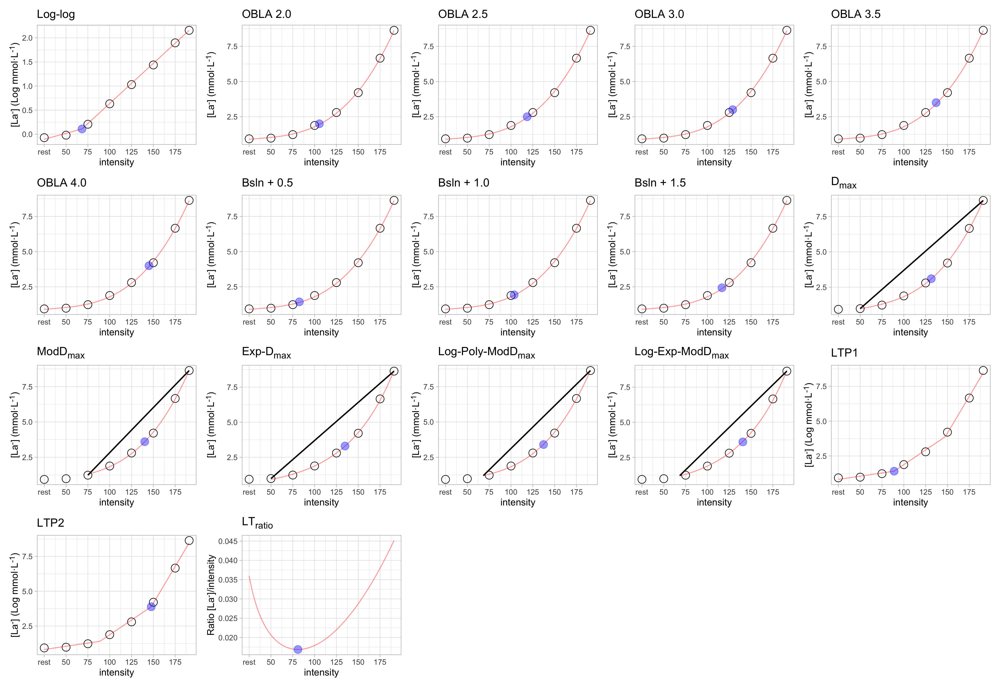
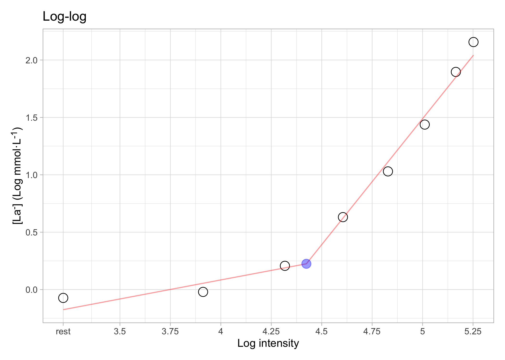
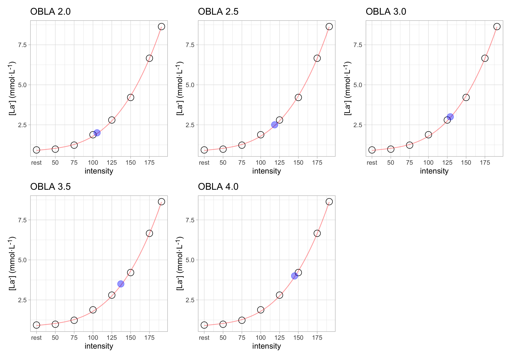
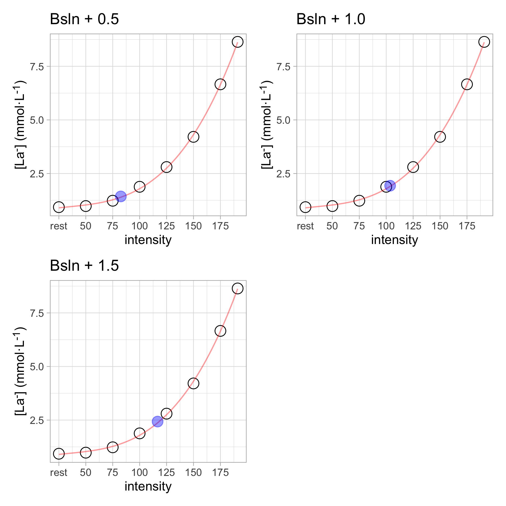
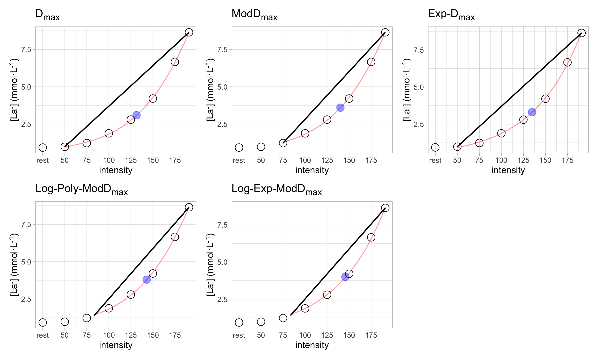
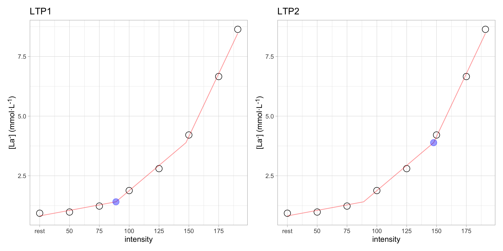
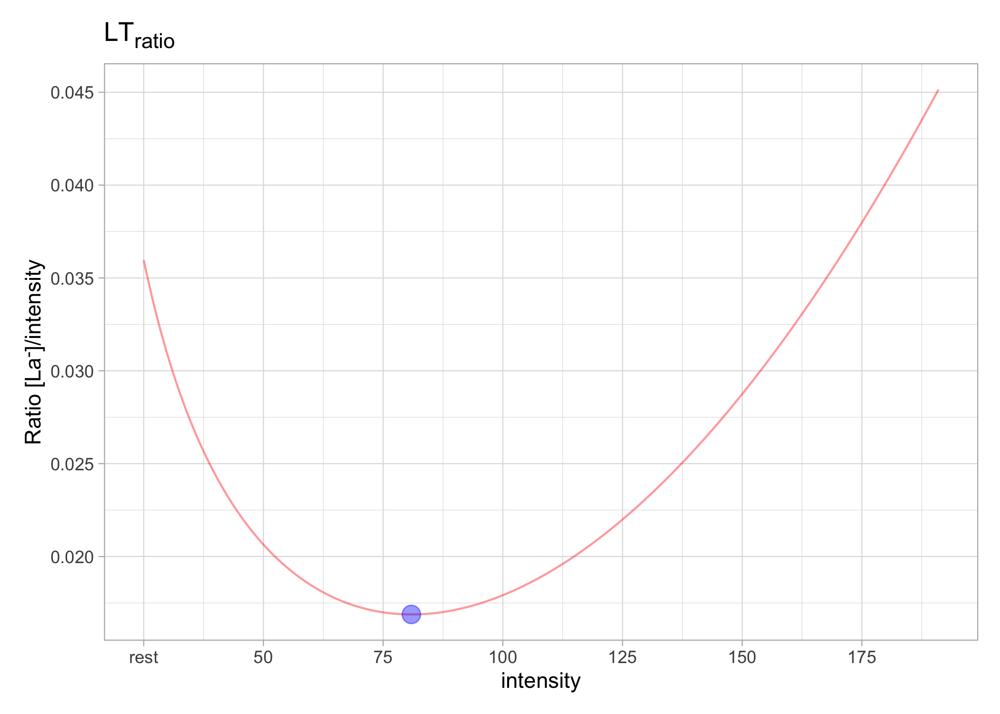
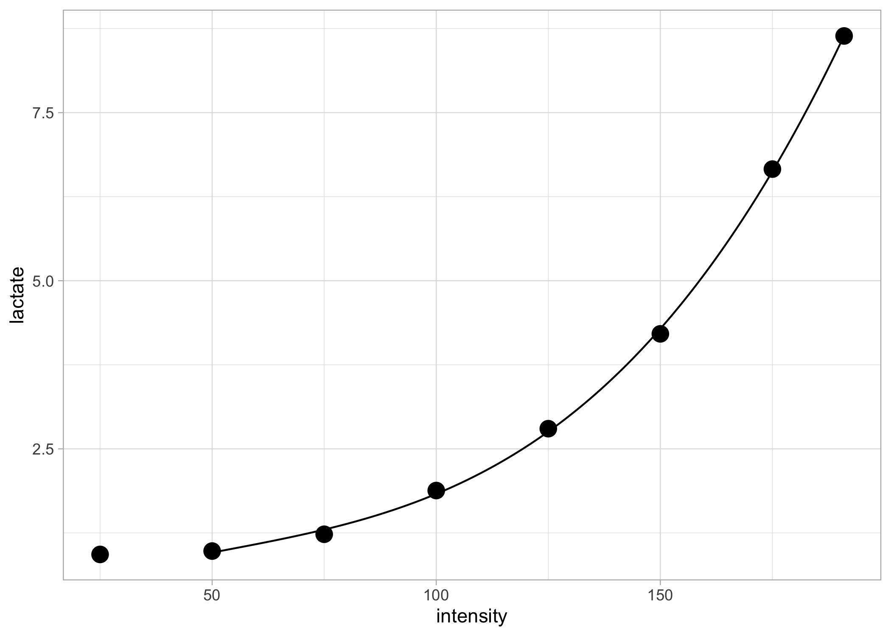

<!-- README.md is generated from README.Rmd. Please edit that file -->

# lactater 

<!-- badges: start -->

[](https://lifecycle.r-lib.org/articles/stages.html#stable)
[](https://CRAN.R-project.org/package=lactater)
[](https://github.com/fmmattioni/lactater/actions/workflows/R-CMD-check.yaml)
[](https://CRAN.R-project.org/package=lactater)
[](https://CRAN.R-project.org/package=lactater)
<!-- badges: end -->

The goal of `lactater` is to provide tools for making it easier to
analyze **lactate thresholds**.

## Installation

You can install the released version of `lactater` from
[CRAN](https://CRAN.R-project.org/package=lactater) with:

``` r
install.packages("lactater")
```

You can install the development version of `lactater` from
[Github](https://github.com/fmmattioni/lactater) with:

``` r
# install.packages("remotes")
remotes::install_github("fmmattioni/lactater")
```

## Demo data

``` r
library(lactater)

demo_data
#>   step length intensity lactate heart_rate
#> 1    0      0         0    0.93         96
#> 2    1      3        50    0.98        114
#> 3    2      3        75    1.23        134
#> 4    3      3       100    1.88        154
#> 5    4      3       125    2.80        170
#> 6    5      3       150    4.21        182
#> 7    6      3       175    6.66        193
#> 8    7      2       191    8.64        198
```

## Usage

With `lactater` you can easily estimate lactate thresholds using one or
multiple methods:

``` r
results_overall <- lactate_threshold(
  .data = demo_data, 
  intensity_column = "intensity", 
  lactate_column = "lactate", 
  heart_rate_column = "heart_rate",
  method = c("Log-log", "OBLA", "Bsln+", "Dmax", "LTP", "LTratio"),
  fit = "3rd degree polynomial", 
  include_baseline = TRUE, 
  sport = "cycling",
  plot = TRUE
)
```

    #> # A tibble: 17 × 7
    #>    method_category method           fitting   intensity lactate heart_rate plot 
    #>    <fct>           <fct>            <chr>         <dbl>   <dbl>      <dbl> <lis>
    #>  1 Log-log         Log-log          3rd degr…      83.4    1.4         140 <gg> 
    #>  2 OBLA            OBLA 2.0         3rd degr…     105.     2           153 <gg> 
    #>  3 OBLA            OBLA 2.5         3rd degr…     118.     2.5         160 <gg> 
    #>  4 OBLA            OBLA 3.0         3rd degr…     129      3           167 <gg> 
    #>  5 OBLA            OBLA 3.5         3rd degr…     137      3.5         171 <gg> 
    #>  6 OBLA            OBLA 4.0         3rd degr…     145      4           176 <gg> 
    #>  7 Bsln+           Bsln + 0.5       3rd degr…      82.5    1.43        139 <gg> 
    #>  8 Bsln+           Bsln + 1.0       3rd degr…     104.     1.93        152 <gg> 
    #>  9 Bsln+           Bsln + 1.5       3rd degr…     117.     2.43        159 <gg> 
    #> 10 Dmax            Dmax             3rd degr…     132.     3.1         168 <gg> 
    #> 11 Dmax            ModDmax          3rd degr…     140.     3.6         173 <gg> 
    #> 12 Dmax            Exp-Dmax         Exponent…     135.     3.3         170 <gg> 
    #> 13 Dmax            Log-Poly-ModDmax 3rd degr…     143      3.8         175 <gg> 
    #> 14 Dmax            Log-Exp-ModDmax  Exponent…     146.     4           177 <gg> 
    #> 15 LTP             LTP1             3rd degr…      88.9    1.5         143 <gg> 
    #> 16 LTP             LTP2             3rd degr…     148.     4.1         178 <gg> 
    #> 17 LTratio         LTratio          B-Spline…      71.2    1.2         132 <gg>



## You can also choose one method:

### Log-log

``` r
results_loglog <- lactate_threshold(
  .data = demo_data, 
  intensity_column = "intensity", 
  lactate_column = "lactate", 
  heart_rate_column = "heart_rate",
  method = "Log-log",
  fit = "3rd degree polynomial", 
  include_baseline = TRUE, 
  sport = "cycling",
  plot = TRUE
)
```

    #> # A tibble: 1 × 7
    #>   method_category method  fitting             intensity lactate heart_rate plot 
    #>   <fct>           <fct>   <chr>                   <dbl>   <dbl>      <dbl> <lis>
    #> 1 Log-log         Log-log 3rd degree polynom…      83.4     1.4        140 <gg>



### OBLA

``` r
results_obla <- lactate_threshold(
  .data = demo_data, 
  intensity_column = "intensity", 
  lactate_column = "lactate", 
  heart_rate_column = "heart_rate",
  method = "OBLA",
  fit = "3rd degree polynomial", 
  include_baseline = TRUE, 
  sport = "cycling",
  plot = TRUE
)
```

    #> # A tibble: 5 × 7
    #>   method_category method   fitting            intensity lactate heart_rate plot 
    #>   <fct>           <fct>    <chr>                  <dbl>   <dbl>      <dbl> <lis>
    #> 1 OBLA            OBLA 2.0 3rd degree polyno…      105.     2          153 <gg> 
    #> 2 OBLA            OBLA 2.5 3rd degree polyno…      118.     2.5        160 <gg> 
    #> 3 OBLA            OBLA 3.0 3rd degree polyno…      129      3          167 <gg> 
    #> 4 OBLA            OBLA 3.5 3rd degree polyno…      137      3.5        171 <gg> 
    #> 5 OBLA            OBLA 4.0 3rd degree polyno…      145      4          176 <gg>



### Bsln+

``` r
results_bsln_plus <- lactate_threshold(
  .data = demo_data, 
  intensity_column = "intensity", 
  lactate_column = "lactate", 
  heart_rate_column = "heart_rate",
  method = "Bsln+",
  fit = "3rd degree polynomial", 
  include_baseline = TRUE, 
  sport = "cycling",
  plot = TRUE
)
```

    #> # A tibble: 3 × 7
    #>   method_category method     fitting          intensity lactate heart_rate plot 
    #>   <fct>           <fct>      <chr>                <dbl>   <dbl>      <dbl> <lis>
    #> 1 Bsln+           Bsln + 0.5 3rd degree poly…      82.5    1.43        139 <gg> 
    #> 2 Bsln+           Bsln + 1.0 3rd degree poly…     104.     1.93        152 <gg> 
    #> 3 Bsln+           Bsln + 1.5 3rd degree poly…     117.     2.43        159 <gg>



### Dmax

``` r
results_dmax <- lactate_threshold(
  .data = demo_data, 
  intensity_column = "intensity", 
  lactate_column = "lactate", 
  heart_rate_column = "heart_rate",
  method = "Dmax",
  fit = "3rd degree polynomial", 
  include_baseline = TRUE, 
  sport = "cycling",
  plot = TRUE
)
```

    #> # A tibble: 5 × 7
    #>   method_category method           fitting    intensity lactate heart_rate plot 
    #>   <fct>           <fct>            <chr>          <dbl>   <dbl>      <dbl> <lis>
    #> 1 Dmax            Dmax             3rd degre…      132.     3.1        168 <gg> 
    #> 2 Dmax            ModDmax          3rd degre…      140.     3.6        173 <gg> 
    #> 3 Dmax            Exp-Dmax         Exponenti…      135.     3.3        170 <gg> 
    #> 4 Dmax            Log-Poly-ModDmax 3rd degre…      143      3.8        175 <gg> 
    #> 5 Dmax            Log-Exp-ModDmax  Exponenti…      146.     4          177 <gg>



### LTP

``` r
results_ltp <- lactate_threshold(
  .data = demo_data, 
  intensity_column = "intensity", 
  lactate_column = "lactate", 
  heart_rate_column = "heart_rate",
  method = "LTP",
  fit = "3rd degree polynomial", 
  include_baseline = TRUE, 
  sport = "cycling",
  plot = TRUE
)
```

    #> # A tibble: 2 × 7
    #>   method_category method fitting              intensity lactate heart_rate plot 
    #>   <fct>           <fct>  <chr>                    <dbl>   <dbl>      <dbl> <lis>
    #> 1 LTP             LTP1   3rd degree polynomi…      88.9     1.5        143 <gg> 
    #> 2 LTP             LTP2   3rd degree polynomi…     148.      4.1        178 <gg>



### LTratio

``` r
results_ltratio <- lactate_threshold(
  .data = demo_data, 
  intensity_column = "intensity", 
  lactate_column = "lactate", 
  heart_rate_column = "heart_rate",
  method = "LTratio",
  fit = "3rd degree polynomial", 
  include_baseline = TRUE, 
  sport = "cycling",
  plot = TRUE
)
```

    #> # A tibble: 1 × 7
    #>   method_category method  fitting            intensity lactate heart_rate plot  
    #>   <fct>           <fct>   <chr>                  <dbl>   <dbl>      <dbl> <list>
    #> 1 LTratio         LTratio B-Spline (default)      71.2     1.2        132 <gg>



## Lactate curve

In case you would like to retrieve the data for producing your own
plots, you can use the `lactate_curve()` function:

``` r
data_lactate_curve <- lactate_curve(
  .data = demo_data,
  intensity_column = "intensity",
  lactate_column = "lactate",
  heart_rate_column = "heart_rate",
  fit = "3rd degree polynomial",
  include_baseline = FALSE,
  sport = "cycling"
)

data_lactate_curve
#> $data
#> # A tibble: 8 × 3
#>   intensity lactate heart_rate
#>       <int>   <dbl>      <int>
#> 1        25    0.93         96
#> 2        50    0.98        114
#> 3        75    1.23        134
#> 4       100    1.88        154
#> 5       125    2.8         170
#> 6       150    4.21        182
#> 7       175    6.66        193
#> 8       191    8.64        198
#> 
#> $lactate_curve
#> # A tibble: 1,411 × 2
#>    intensity lactate
#>        <dbl>   <dbl>
#>  1      50     0.957
#>  2      50.1   0.959
#>  3      50.2   0.960
#>  4      50.3   0.961
#>  5      50.4   0.963
#>  6      50.5   0.964
#>  7      50.6   0.965
#>  8      50.7   0.966
#>  9      50.8   0.968
#> 10      50.9   0.969
#> # ℹ 1,401 more rows
#> 
#> $heart_rate_response
#> # A tibble: 1,411 × 2
#>    intensity heart_rate
#>        <dbl>      <dbl>
#>  1      50         120.
#>  2      50.1       120.
#>  3      50.2       120.
#>  4      50.3       120.
#>  5      50.4       120.
#>  6      50.5       120.
#>  7      50.6       120.
#>  8      50.7       120.
#>  9      50.8       120.
#> 10      50.9       120.
#> # ℹ 1,401 more rows
```

And then you easily produce plots like the following:

``` r
library(ggplot2)

ggplot() +
  geom_path(data = data_lactate_curve$lactate_curve, aes(intensity, lactate)) +
  geom_point(data = data_lactate_curve$data, aes(intensity, lactate), size = 4) +
  theme_light()
```



``` r

ggplot() +
  geom_path(data = data_lactate_curve$heart_rate_response, aes(intensity, heart_rate)) +
  geom_point(data = data_lactate_curve$data, aes(intensity, heart_rate), size = 4) +
  theme_light()
```


You can also combine the results from the `lactate_threshold()` function
to plot the results:

``` r
ggplot() +
  geom_path(data = data_lactate_curve$lactate_curve, aes(intensity, lactate)) +
  geom_point(data = data_lactate_curve$data, aes(intensity, lactate), size = 4) +
  geom_point(data = results_overall, aes(intensity, lactate, color = method), size = 3) +
  theme_light()
```


You can also compare the lactate curves after a training period, for
example:

``` r
data_after_training <- tibble::tribble(
  ~step, ~length, ~intensity, ~lactate, ~heart_rate,
     0L,      0L,         0L,     0.93,         88L,
     1L,      3L,        50L,     0.98,        108L,
     2L,      3L,        75L,     1.12,        126L,
     3L,      3L,       100L,     1.6,         138L,
     4L,      3L,       125L,      2.1,        156L,
     5L,      3L,       150L,     3.75,        169L,
     6L,      3L,       175L,     4.98,        182L,
     7L,      3L,       200L,     7.78,        190L,
     8L,      3L,       225L,     10.12,       199L
  )

data_lactate_curve_after_training <- lactate_curve(
  .data = data_after_training,
  intensity_column = "intensity",
  lactate_column = "lactate",
  heart_rate_column = "heart_rate",
  fit = "3rd degree polynomial",
  include_baseline = FALSE,
  sport = "cycling"
)
```

``` r
ggplot() +
  geom_path(data = data_lactate_curve$lactate_curve, aes(intensity, lactate, color = "before training")) +
  geom_point(data = data_lactate_curve$data, aes(intensity, lactate, color = "before training"), size = 4) +
  geom_path(data = data_lactate_curve_after_training$lactate_curve, aes(intensity, lactate, color = "after training")) +
  geom_point(data = data_lactate_curve_after_training$data, aes(intensity, lactate, color = "after training"), size = 4) +
  theme_light() +
  labs(color = NULL)
```


``` r

ggplot() +
  geom_path(data = data_lactate_curve$heart_rate_response, aes(intensity, heart_rate, color = "before training")) +
  geom_point(data = data_lactate_curve$data, aes(intensity, heart_rate, color = "before training"), size = 4) +
  geom_path(data = data_lactate_curve_after_training$heart_rate_response, aes(intensity, heart_rate, color = "after training")) +
  geom_point(data = data_lactate_curve_after_training$data, aes(intensity, heart_rate, color = "after training"), size = 4) +
  theme_light() +
  labs(color = NULL)
```


## Related work

- [lactate-R](http://www.uiginn.com/lactate/lactate-r.html)
- [cycleRtools](https://github.com/cran/cycleRtools)
- [exPhysR](https://github.com/dhammarstrom/exPhysR)
